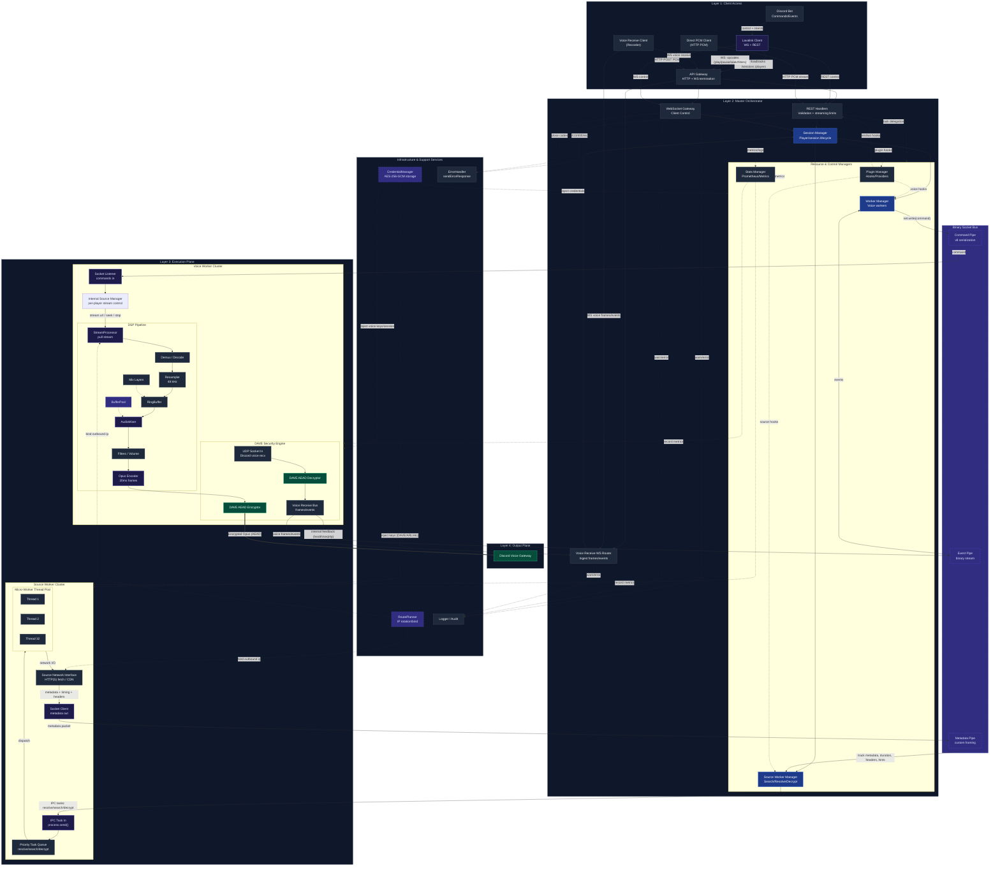

<p align="center">
  
</p>

<h1 align="center">NodeLink</h1>

<p align="center">
  <b>A modern Lavalink alternative built entirely in Node.js</b><br>
  Lightweight, modular, and optimized for real-time performance.
</p>

<p align="center">
  <a href="https://nodelink.js.org">📚 Documentation</a> •
  <a href="https://nodelink.js.org/docs/api/rest">API Reference</a> •
  <a href="https://nodelink.js.org/docs/differences">NodeLink vs Lavalink</a> •
  <a href="https://nodelink.js.org/docs/troubleshooting">Troubleshooting</a>
</p>

---

## Prerequisites

* **Node.js** v22 or higher (v24 recommended)
* **Git**

---

## Overview

**NodeLink** is an alternative audio server built in **Node.js**, designed for those who value control and efficiency. 🌿
It doesn’t try to reinvent the wheel — it just makes it spin with less weight.
Easy to configure, naturally scalable, and with smooth playback, it provides a solid foundation for music bots and real-time audio systems.

Created by Brazilian developers, NodeLink was born from the desire for a simpler, open, and truly accessible audio server for everyone.

**Full documentation available at [nodelink.js.org](https://nodelink.js.org)** 💚

---

## Features

* **100% Node.js implementation** – No external runtime required
* **Lavalink-compatible API** – Works with most existing clients
* **Optimized decoding** ⚡ – Powered by WebAssembly and native modules
* **Worker-based architecture** – Each player can run in its own process for true isolation
* **Real-time audio filters** – Equalizer, timescale, tremolo, compressor, echo, chorus, phaser, and more
* **Low memory footprint** – Efficient even with multiple active players
* **Prometheus metrics** – Production-ready monitoring with detailed statistics
* **Multiple source support** – 15+ sources including YouTube, Spotify, Apple Music, Deezer, and more

---

## Quick Start

```bash
# Clone the repository
git clone https://github.com/PerformanC/NodeLink.git
cd NodeLink

# Install dependencies
npm install

# Copy the default configuration file
cp config.default.js config.js

# Start the server
npm run start
```

Once started, NodeLink runs a Lavalink-compatible WebSocket server, ready for immediate use.

### Docker

NodeLink also supports Docker for easy deployment:

```bash
# Using Docker Compose
docker-compose up -d

# Or using Docker directly
docker build -t nodelink .
docker run -p 2333:2333 nodelink
```

**See the Docker guide:** [nodelink.js.org/docs/advenced/docker](https://nodelink.js.org/docs/advenced/docker)

---

### Diagram



---

## Usage

NodeLink is compatible with most Lavalink clients, as it implements nearly the entire original API.
However, some clients may not work properly, since NodeLink changes certain behaviors and endpoints.

| Client                                                              | Platform     | v3 supported? | NodeLink Features? | NodeLink major version | Notes                                                                                                                                                                                                           |
| ------------------------------------------------------------------- | ------------ | ------------- | ------------------ | ---------------------- | --------------------------------------------------------------------------------------------------------------------------------------------------------------------------------------------------------------- |
| [Lavalink-Client](https://github.com/lavalink-devs/Lavalink-Client) | JVM          | unknown       | No                 | v1 and v2              |                                                                                                                                                                                                                 |
| [Lavalink.kt](https://github.com/DRSchlaubi/Lavalink.kt)            | Kotlin       | unknown       | No                 | v1                     |                                                                                                                                                                                                                 |
| [DisGoLink](https://github.com/disgoorg/disgolink)                  | Go           | unknown       | No                 | v1 and v2              |                                                                                                                                                                                                                 |
| [Lavalink.py](https://github.com/devoxin/lavalink.py)               | Python       | unknown       | No                 | v1 and v2              |                                                                                                                                                                                                                 |
| [Mafic](https://github.com/ooliver1/mafic)                          | Python       | unknown       | No                 | v1 and v2              |                                                                                                                                                                                                                 |
| [Wavelink](https://github.com/PythonistaGuild/Wavelink)             | Python       | Yes           | No                 | v1, v2, v3             |                                                                                                                                                                                                                 |
| [Pomice](https://github.com/cloudwithax/pomice)                     | Python       | unknown       | No                 | v1 and v2              |                                                                                                                                                                                                                 |
| [lava-lyra](https://github.com/ParrotXray/lava-lyra)                | Python       | Yes           | Yes                | v3                     |                                                                                                                                                                                                                 |
| [Hikari-ongaku](https://github.com/MPlatypus/hikari-ongaku)         | Python       | unknown       | No                 | v1 and v2              |                                                                                                                                                                                                                 |
| [Moonlink.js](https://github.com/1Lucas1apk/moonlink.js)            | TypeScript   | Yes           | No                 | v1, v2, v3             |                                                                                                                                                                                                                 |
| [Magmastream](https://github.com/Blackfort-Hosting/magmastream)     | TypeScript   | unknown       | No                 | v1                     |                                                                                                                                                                                                                 |
| [Lavacord](https://github.com/lavacord/Lavacord)                    | TypeScript   | unknown       | No                 | v1 and v2              |                                                                                                                                                                                                                 |
| [Shoukaku](https://github.com/Deivu/Shoukaku)                       | TypeScript   | Yes           | No                 | v1, v2, v3             |                                                                                                                                                                                                                 |
| [Lavalink-Client](https://github.com/tomato6966/Lavalink-Client)    | TypeScript   | No            | No                 | v1                     | Unstable for some users who have reported this over the months; maintainer does not commit to feature support; users must implement missing behavior externally; recommended to migrate to a more stable client |
| [Rainlink](https://github.com/RainyXeon/Rainlink)                   | TypeScript   | unknown       | No                 | v1 and v2              |                                                                                                                                                                                                                 |
| [Poru](https://github.com/parasop/Poru)                             | TypeScript   | unknown       | No                 | v1 and v2              |                                                                                                                                                                                                                 |
| [Blue.ts](https://github.com/ftrapture/blue.ts)                     | TypeScript   | unknown       | No                 | v1 and v2              |                                                                                                                                                                                                                 |
| [FastLink](https://github.com/PerformanC/FastLink)                  | Node.js      | Yes           | No                 | v1, v2, v3             |                                                                                                                                                                                                                 |
| [Riffy](https://github.com/riffy-team/riffy)                        | Node.js      | Yes           | No                 | v1, v2, v3             |                                                                                                                                                                                                                 |
| [TsumiLink](https://github.com/Fyphen1223/TsumiLink)                | Node.js      | unknown       | No                 | v1 and v2              |                                                                                                                                                                                                                 |
| [AquaLink](https://github.com/ToddyTheNoobDud/AquaLink)             | JavaScript   | Yes           | Yes                | v1, v2, v3             |                                                                                                                                                                                                                 |
| [DisCatSharp](https://github.com/Aiko-IT-Systems/DisCatSharp)       | .NET         | unknown       | No                 | v1 and v2              |                                                                                                                                                                                                                 |
| [Lavalink4NET](https://github.com/angelobreuer/Lavalink4NET)        | .NET         | unknown       | No                 | v1 and v2              |                                                                                                                                                                                                                 |
| [Nomia](https://github.com/DHCPCD9/Nomia)                           | .NET         | unknown       | No                 | v1 and v2              |                                                                                                                                                                                                                 |
| [CogLink](https://github.com/PerformanC/Coglink)                    | C            | unknown       | No                 | v1 and v2              |                                                                                                                                                                                                                 |
| [Lavalink-rs](https://gitlab.com/vicky5124/lavalink-rs)             | Rust, Python | unknown       | No                 | v1 and v2              |                                                                                                                                                                                                                 |
| [nyxx_lavalink](https://github.com/nyxx-discord/nyxx_lavalink)      | Dart         | unknown       | No                 | v1                     |                                                                                                                                                                                                                 |

> [!IMPORTANT]
> Lack of explicit NodeLink support *usually* means that the client implements the Lavalink API inconsistently, not following its defined formats and fields. Using such clients may lead to unexpected behavior.

> [!NOTE]
> Data was sourced from the [official Lavalink documentation](https://lavalink.dev/clients#client-libraries) and manually updated.
> Compatibility information for NodeLink v3 is still being verified.

---

### Memory Usage

NodeLink is designed to be memory-efficient ⚡

At startup, it typically uses around **50 MB**, stabilizing near **24 MB** when idle.
Each active player adds between **4 and 15 MB**, depending on stream format and applied filters.

Cluster workers run independently, maintaining their own caches and pipelines — enabling parallel, scalable playback without session interference.

### Monitoring Production

NodeLink exposes **Prometheus metrics** at `/v4/metrics` for production monitoring:

* Audio frame statistics (sent, nulled, deficit)
* Memory breakdown (RSS, heap, external buffers)
* Event loop lag and GC pauses
* CPU load and active handles
* API request tracking per endpoint
* Source usage tracking

**See the monitoring guide:** [nodelink.js.org/docs/advenced/prometheus](https://nodelink.js.org/docs/advenced/prometheus)

---

### Architecture

NodeLink follows a **worker-based model**, where each process manages its own players and buffers.
Each worker acts as an autonomous mini-instance, communicating with the main process only when necessary.
This reduces bottlenecks and keeps stability even under heavy load.

Its modular structure also allows swapping components, adding new sources or filters, and adjusting internal behavior without touching the core server.

---

### Dependencies

Internally, NodeLink combines native and WebAssembly modules for precise audio processing, buffering, and packet handling.

- [`@performanc/pwsl-server`](https://github.com/PerformanC/internals/tree/PWSL-server) ⚡
- [`@performanc/voice`](https://github.com/PerformanC/voice) ⚡
- [`@alexanderolsen/libsamplerate-js`](https://www.npmjs.com/package/@alexanderolsen/libsamplerate-js)
- [`@ecliptia/faad2-wasm`](https://www.npmjs.com/package/@ecliptia/faad2-wasm) 💙
- [`@ecliptia/seekable-stream`](https://github.com/1Lucas1apk/seekable-stream) 💙
- [`@toddynnn/symphonia-decoder`](https://www.npmjs.com/package/@toddynnn/symphonia-decoder)
- [`mp4box`](https://www.npmjs.com/package/mp4box)
- [`myzod`](https://www.npmjs.com/package/myzod)
- [`toddy-mediaplex`](https://www.npmjs.com/package/toddy-mediaplex)

**Optional Dependencies:**

- [`prom-client`](https://www.npmjs.com/package/prom-client) – Required only if Prometheus metrics are enabled in config. Install with `npm install prom-client`.

> [!NOTE]
> Dependencies marked with ⚡ are maintained by PerformanC.  
> Dependencies marked with 💙 are maintained by Ecliptia.

These modules form the essential foundation that keeps NodeLink’s playback stable and reliable.

---

## Contributing

Pull requests are welcome!

Feel free to open issues, share suggestions, or join discussions on Discord.
Every contribution helps make NodeLink more stable, accessible, and well-documented.

**Found a bug?** [Report it](https://github.com/PerformanC/NodeLink/issues) and we'll fix it.  
**Need a feature?** Let us know and we'll consider it.  
**Want to contribute?** The codebase is waiting for you.

**Together, we make NodeLink better.** 💚

---

## Special Thanks

A huge thank you to **@RainyXeon** for generously allowing us to incorporate the NicoVideo streaming logic from [LunaStream](https://github.com/LunaStream/LunaStream). Your contribution made this possible and is greatly appreciated!

---

## Community & Support

Questions, feedback, or contributions are always welcome:

* [PerformanC Discord Server](https://discord.gg/uPveNfTuCJ)
* [Ecliptia "Imagine" Server](https://discord.gg/fzjksWS65v)
* [Official Documentation](https://nodelink.js.org)

---

## License

NodeLink is open-source software released under the **GNU General Public License v3.0**.
See [LICENSE](LICENSE) for full details.

---

### Motivation

NodeLink was born from a simple desire: to understand and master every detail of an audio server — without relying on closed, heavy, or complicated solutions.
The goal is to make audio accessible, transparent, and fun to build.

---

## Star History

<a href="https://www.star-history.com/#PerformanC/NodeLink&type=date&legend=top-left">
 <picture>
   <source media="(prefers-color-scheme: dark)" srcset="https://api.star-history.com/svg?repos=PerformanC/NodeLink&type=date&theme=dark&legend=top-left" />
   <source media="(prefers-color-scheme: light)" srcset="https://api.star-history.com/svg?repos=PerformanC/NodeLink&type=date&legend=top-left" />
   
 </picture>
</a>

---

<p align="center">
  <sub>NodeLink — where lightness meets sound. 🌿</sub><br>
  <sub>Made with ⚡ and curiosity by PerformanC and Ecliptia 💙</sub><br>
  <sub>(BRAZIL 🇧🇷)</sub>
</p>

---

